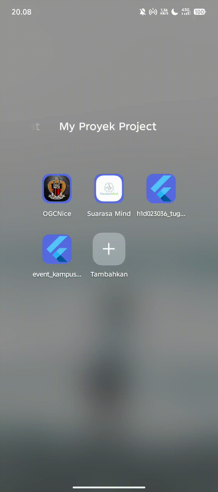
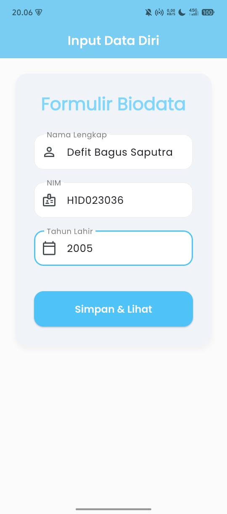
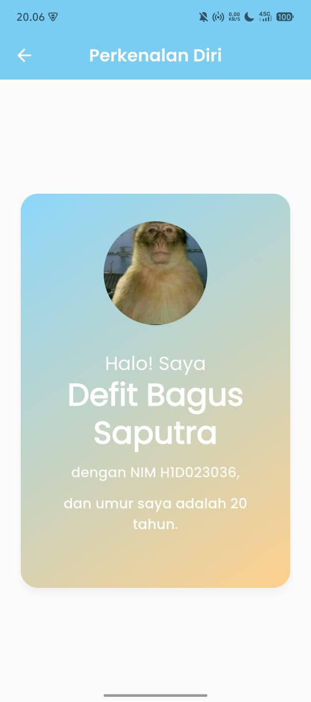

# Tugas 6 Flutter - Input Biodata dan Passing Data

Proyek ini adalah aplikasi Flutter sederhana yang dibuat untuk memenuhi Tugas 6 Praktikum Pemrograman Mobile.

## 👨‍🎓 Identitas Mahasiswa

* **Nama** : Defit Bagus Saputra
* **NIM** : H1D023036
* **Shift Awal** : C
* **Shift Akhir** : F

## 📝 Deskripsi Proyek

Aplikasi ini memiliki dua halaman utama:
1.  **Halaman Form Input:** Pengguna memasukkan data diri (Nama, NIM, dan Tahun Lahir).
2.  **Halaman Tampil Data:** Menampilkan data yang telah di-input dari halaman form, sekaligus menghitung umur pengguna berdasarkan tahun lahir.

Tujuan utama dari proyek ini adalah untuk mendemonstrasikan pemahaman tentang navigasi antar halaman dan proses **passing data** (mengirim data) dari satu *widget* ke *widget* lainnya menggunakan *Constructor Passing*.

## 🚀 Demo Aplikasi

Berikut adalah demo singkat penggunaan aplikasi:



## 📸 Tampilan Aplikasi (Screenshot)

| Halaman Form Input | Halaman Tampil Data |
| :---: | :---: |
|  |  |

## 📂 Struktur Folder

Struktur folder utama dalam proyek ini diatur sebagai berikut untuk memisahkan logika utama, UI, dan aset:

```bash
h1d023036_tugas6/
├── assets/                
│   ├── demo.gif
│   ├── form_data.jpeg
│   └── tampil_data.jpeg
├── lib/
│   ├── ui/                
│   │   ├── form_data.dart    
│   │   └── tampil_data.dart    
│   └── main.dart           
├── pubspec.yaml          
└── README.md              
````

## ⚙️ Penjelasan Proses Passing Data

Proses pengiriman data dari halaman form ke halaman tampil data menggunakan metode **Constructor Passing**.

### 1\. Pengiriman Data (dari `form_data.dart`)

  * Data dari `TextField` diambil menggunakan `TextEditingController`.
  * Saat tombol "Simpan" ditekan, `Navigator.push()` dipanggil.
  * Data (nama, nim, tahunLahir) dilemparkan sebagai parameter ke dalam *constructor* halaman `TampilData`.

<!-- end list -->

```dart
// file: lib/ui/form_data.dart

void _kirimData() {
  String nama = _namaController.text;
  String nim = _nimController.text;
  String tahunLahir = _tahunLahirController.text;

  Navigator.push(
    context,
    MaterialPageRoute(
      builder: (context) => TampilData(
        nama: nama,
        nim: nim,
        tahunLahir: tahunLahir,
      ),
    ),
  );
}
```

### 2\. Penerimaan Data (di `tampil_data.dart`)

  * Kelas `TampilData` (sebuah `StatelessWidget`) disiapkan untuk menerima data.
  * Variabel `final String` dideklarasikan untuk menampung data yang dikirim.
  * *Constructor* kelas `TampilData` di-update untuk mewajibkan (`required`) parameter data tersebut.

<!-- end list -->

```dart
// file: lib/ui/tampil_data.dart

class TampilData extends StatelessWidget {
  final String nama;
  final String nim;
  final String tahunLahir;

  const TampilData({
    super.key,
    required this.nama,
    required this.nim,
    required this.tahunLahir,
  });

  @override
  Widget build(BuildContext context) {
    int umur = _hitungUmur(); // _hitungUmur() adalah fungsi custom
    
    return Scaffold(
      body: Center(
        child: Text(
          'Nama saya $nama, NIM $nim, dan umur saya $umur tahun',
        ),
      ),
    );
  }
}
```

```
```
